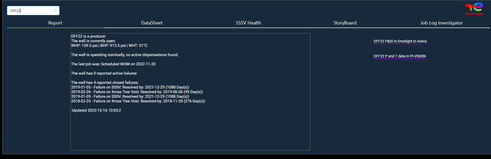

.. raw:: html

   <!-- Improved compatibility of back to top link: See: https://github.com/othneildrew/Best-README-Template/pull/73 -->

.. raw:: html

   <!-- PROJECT SHIELDS -->

.. raw:: html

   <!--
   *** I'm using markdown "reference style" links for readability.
   *** Reference links are enclosed in brackets [ ] instead of parentheses ( ).
   *** See the bottom of this document for the declaration of the reference variables
   *** for contributors-url, forks-url, etc. This is an optional, concise syntax you may use.
   *** https://www.markdownguide.org/basic-syntax/#reference-style-links
   -->

.. raw:: html

   <!-- PROJECT LOGO -->

.. container::

   .. raw:: html

      <h3 align="center">

   DataBench

   .. raw:: html

      </h3>

   .. raw:: html

      

   DataBench is a enhanced visualization tools for TEPDK wells. Explore
   the docs » View website · Report Bug · Request Feature

   .. raw:: html

      

.. raw:: html

   <!-- TABLE OF CONTENTS -->

.. raw:: html

   

Table of Contents

.. raw:: html

   <ol>

.. raw:: html

   <li>

About The Project

.. raw:: html

   <ul>

.. raw:: html

   <li>

Built With

.. raw:: html

   </li>

.. raw:: html

   </ul>

.. raw:: html

   </li>

.. raw:: html

   <li>

Getting Started

.. raw:: html

   <ul>

.. raw:: html

   <li>

Prerequisites

.. raw:: html

   </li>

.. raw:: html

   <li>

Installation

.. raw:: html

   </li>

.. raw:: html

   </ul>

.. raw:: html

   </li>

.. raw:: html

   <li>

Roadmap

.. raw:: html

   </li>

.. raw:: html

   <li>

License

.. raw:: html

   </li>

.. raw:: html

   <li>

Contact

.. raw:: html

   </li>

.. raw:: html

   <li>

Acknowledgments

.. raw:: html

   </li>

.. raw:: html

   </ol>

.. raw:: html

   

.. raw:: html

   <!-- ABOUT THE PROJECT -->

About The Project
-----------------

|Product Name Screen Shot|

DataBench aim to help TEPDK employees to see wells data in a new way
thanks to ahead of the curve graph and intereactivity.

.. raw:: html

   

(back to top)

.. raw:: html

   

Built With
~~~~~~~~~~

-  |Python|
-  |Dash|

.. raw:: html

   

(back to top)

.. raw:: html

   

.. raw:: html

   <!-- GETTING STARTED -->

Getting Started
---------------

This is an example of how you may give instructions on setting up your
project locally. To get a local copy up and running follow these simple
example steps.

Prerequisites
~~~~~~~~~~~~~

This is an example of how to list things you need to use the software
and how to install them. \* Python \* Dash \* Dash mantine components \*
Dash iconify \* Openpyxl

Installation
~~~~~~~~~~~~

1. Clone the repo

   .. code:: sh

      git clone https://github.com/TotalEnergies/well_data_picker.git

2. Look at path of all feature : SSSV HEALTH, STB, REPORT etc. And link
   it to the good location. In folder that have the correct data.

3. Start all API file and let thoses API run:

   -  API naratec :
      https://github.com/TotalEnergies/well_data_picker/blob/preprod/API/apiNaratec.py
   -  API woms/npdms/p6/tmore :
      https://github.com/TotalEnergies/well_data_picker/blob/preprod/API/apiworms.py

4. In the preproc file:
   https://github.com/TotalEnergies/well_data_picker/blob/preprod/API/createdump.py
   link path to the good folder and add the correct API ip run it. Wait
   50 min and all files will be generated.

5. Now you have the bare minimun ot start the app.py file.

.. raw:: html

   

(back to top)

.. raw:: html

   

.. raw:: html

   <!-- ROADMAP -->

Roadmap
-------

-  ☐ More wells
-  ☐ More amazing graphs
-  ☐ Better UX/UI

   -  ☐ Ask feedback

See the `open
issues <https://github.com/github_username/repo_name/issues>`__ for a
full list of proposed features (and known issues).

.. raw:: html

   

(back to top)

.. raw:: html

   

.. raw:: html

   <!-- LICENSE -->

License
-------

This repo and every lines of this codes are intelectual properties of
Totalenergies.

.. raw:: html

   

(back to top)

.. raw:: html

   

.. raw:: html

   <!-- CONTACT -->

Contact
-------

Adam Wecker - `dev website <http://adamwecker.fr/>`__ -
adam.wecker@external.totalenergies.com

.. raw:: html

   

(back to top)

.. raw:: html

   

.. raw:: html

   <!-- ACKNOWLEDGMENTS -->

Acknowledgments
---------------

-  Everythings from this repo must be run and stay on Totalenergies
   network. Else it’s unsafe and most of connection wont work.
-  
-  

.. raw:: html

   

(back to top)

.. raw:: html

   

.. raw:: html

   <!-- MARKDOWN LINKS & IMAGES -->

.. raw:: html

   <!-- https://www.markdownguide.org/basic-syntax/#reference-style-links -->

.. |Python| image:: https://img.shields.io/badge/python-3.9-blue.svg
   :target: https://www.python.org/
.. |Dash| image:: https://img.shields.io/badge/Plotly-%233F4F75.svg?style=for-the-badge&logo=plotly&logoColor=white
   :target: https://dash.plotly.com/
